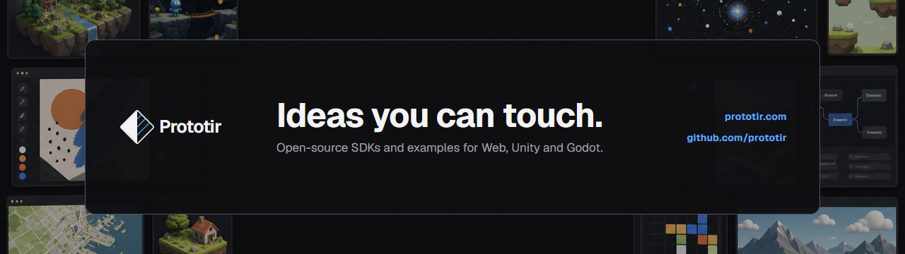

  

# Prototir

Prototir is a platform for publishing, playing, and testing interactive web prototypes.

Build with plain HTML, CSS, JavaScript, Three.js, Unity, or Godot, then connect your experience to Prototir through lifecycle events, scores, persistent storage, analytics events, and optional managed AI.

- [Open Prototir](https://prototir.com)
- [Creator documentation](https://prototir.com/docs/creators)
- [Web SDK](https://github.com/prototir/web-sdk)
- [Unity SDK](https://github.com/prototir/unity-sdk)
- [Godot SDK](https://github.com/prototir/godot-sdk)
- [Examples](https://github.com/orgs/prototir/repositories?q=examples)
